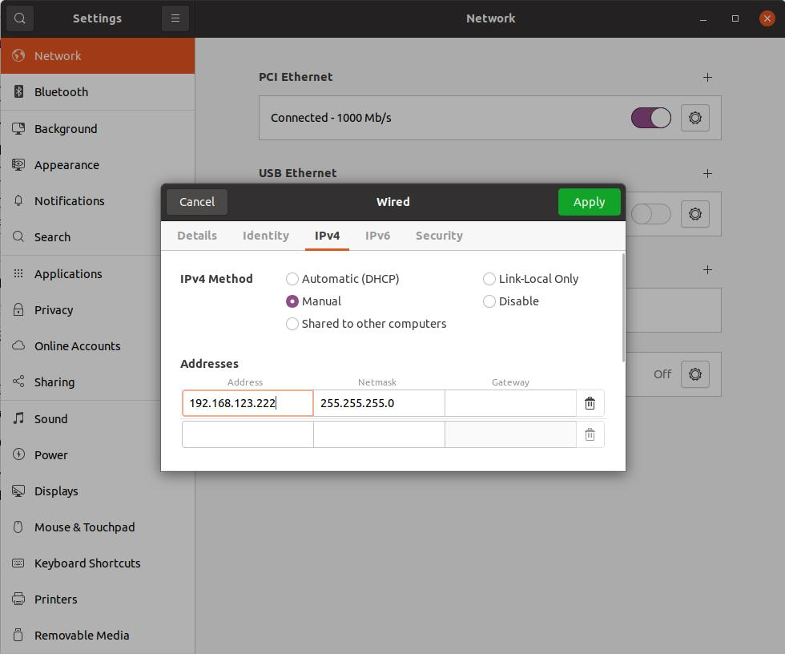
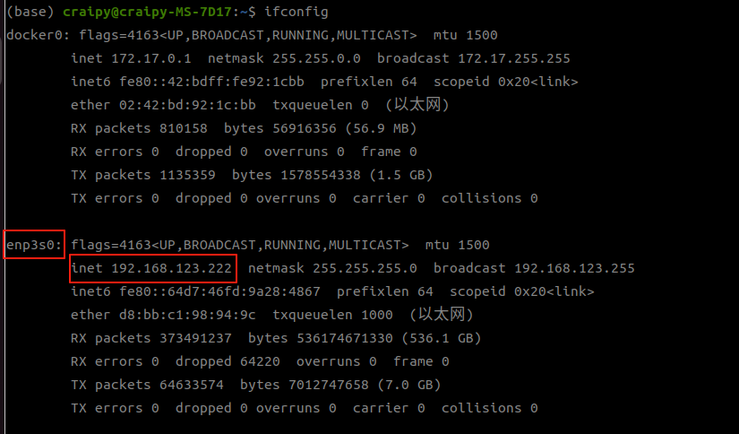

# G1 Deploy

Unitree G1 (29 DOF) 强化学习策略部署，支持 Sim2Sim (MuJoCo) 和 Sim2Real (真实机器人)。

---

## Sim2Sim (MuJoCo)

在 MuJoCo 中验证策略，使用 Unitree 官方手柄 (USB) 控制。

### Installization

```bash
conda activate env_isaaclab1
pip install torch numpy scipy pyyaml mujoco pygame
```

### Startup

```bash
python deploy/g1_deploy/sim2sim_walk.py --model policy.pt --config g1_walk.yaml
```

### Gamesir 

| 操作         | 功能              |
| ------------ | ----------------- |
| 左摇杆 上/下 | vx 前进/后退      |
| 左摇杆 左/右 | vy 横移           |
| 右摇杆 左/右 | vyaw 转向         |
| RB + A       | Walk 策略         |
| RB + B/X/Y   | Policy 1/2/3 占位 |
| Start        | 退出              |

---

## Sim2Real


### Installation

```bash
conda activate legged_rl_lab
cd deploy/g1_deploy

# 1. Install cyclonedds first (required by unitree_sdk2_python)
git clone https://github.com/eclipse-cyclonedds/cyclonedds -b releases/0.10.x
cd cyclonedds
mkdir -p build install
cd build
cmake .. -DCMAKE_INSTALL_PREFIX=../install
cmake --build . --target install -j"$(nproc)"

# 2. 修复 env_isaaclab1 缺失 Python.h
conda install -n env_isaaclab1 --force-reinstall -y python=3.11.14


# 3. Install unitree_sdk2_python
cd ../..
git clone https://github.com/unitreerobotics/unitree_sdk2_python.git
cd unitree_sdk2_python
export CYCLONEDDS_HOME=$(pwd)/../cyclonedds/install
pip install -e .
```


### Startup Process

#### 1. Start the robot
开机，g1进入`零力矩模式`

#### 2. Enter the debugging mode


按下`L2+R2` G1进入`调试模式`，此时为`阻尼模式`，

然后可以按下`L2 + A`确认是否进入`调试模式`，最后按下`L2 + R2`回到`阻尼模式`

> 注意：在调试模式遇到紧急情况，按下`L2 + B`即可进入阻尼模式

#### 3. Connect the robot
用网线连接 PC 与机器人（USB Ethernet 或直连网口）

将 PC 网卡 IP 设置为 `192.168.123.X` 网段，推荐 `192.168.123.99`



用`ifconfig`查看网口地址



验证连通性：

```bash
ping 192.168.123.161 
```

#### 4. Start the Program

假设网线连接的网卡名称为 `enp108s0`

```bash
#
python deploy.py --net enp108s0 --config_path configs/g1.yaml

python sim2real_walk.py --model g1_walk.pt --config g1_walk.yaml --iface enp108s0
```

<!-- 或干跑模式（仅运行策略推理，不发送 lowcmd，用于调试）：

```bash
python sim2real_walk.py --dry-run --iface enp108s0
``` -->

##### 4.1 零力矩状态

启动后，机器人关节将处于零力矩状态。你可以用手摇动机器人关节来感受和确认。

##### 4.2 默认位置状态

在零力矩状态下，按下遥控器的 Start 按钮，机器人将移动到默认关节位置状态。

机器人移动到默认关节位置后，可以缓慢降低吊装机制，让机器人的脚接触地面。

##### 4.3 运动控制模式

准备工作完成后，按下遥控器上的 A 按钮，机器人将原地踏步。机器人稳定后，可以逐渐降低吊绳，给机器人一定的活动空间。

此时，你可以使用遥控器上的摇杆来控制机器人的运动：
- **左摇杆前后**：控制机器人 X 方向的运动速度
- **左摇杆左右**：控制机器人 Y 方向的运动速度
- **右摇杆左右**：控制机器人偏航角速度

##### 4.4 退出控制

在运动控制模式下，按下遥控器上的 Select 按钮，机器人将进入阻尼模式并下落，程序将退出。或者在终端中使用 `Ctrl+C` 关闭程序。


